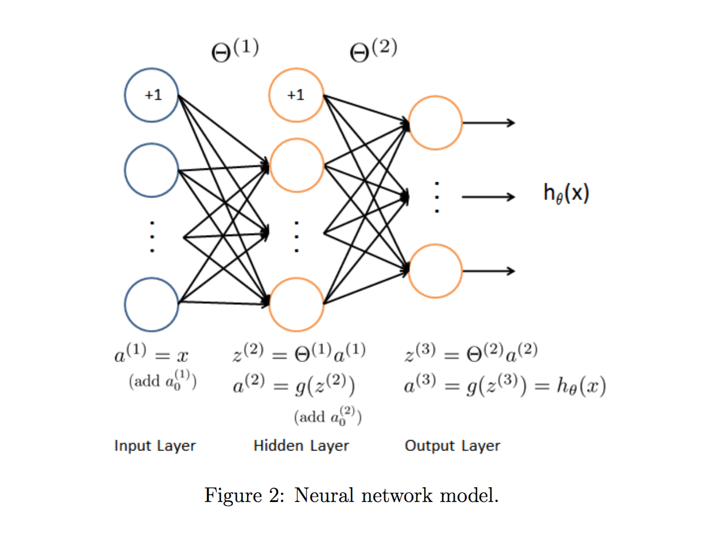
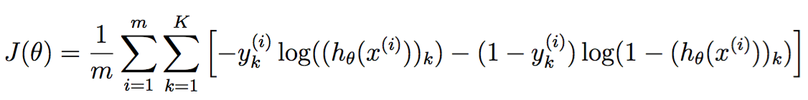
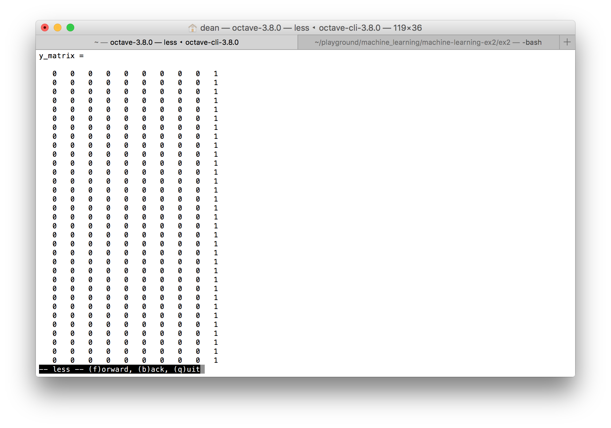
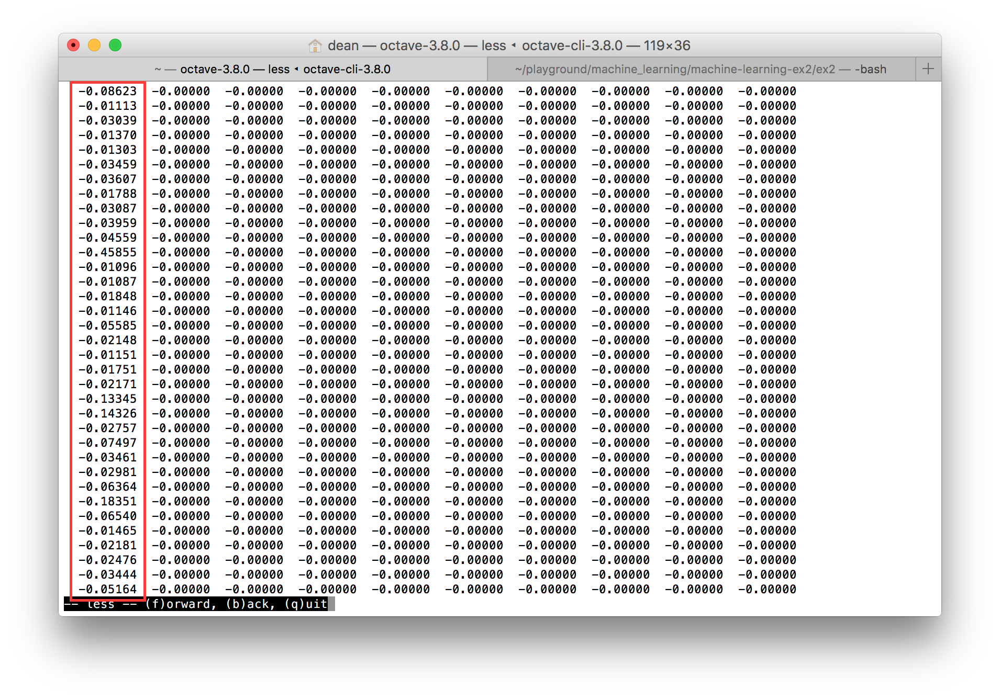
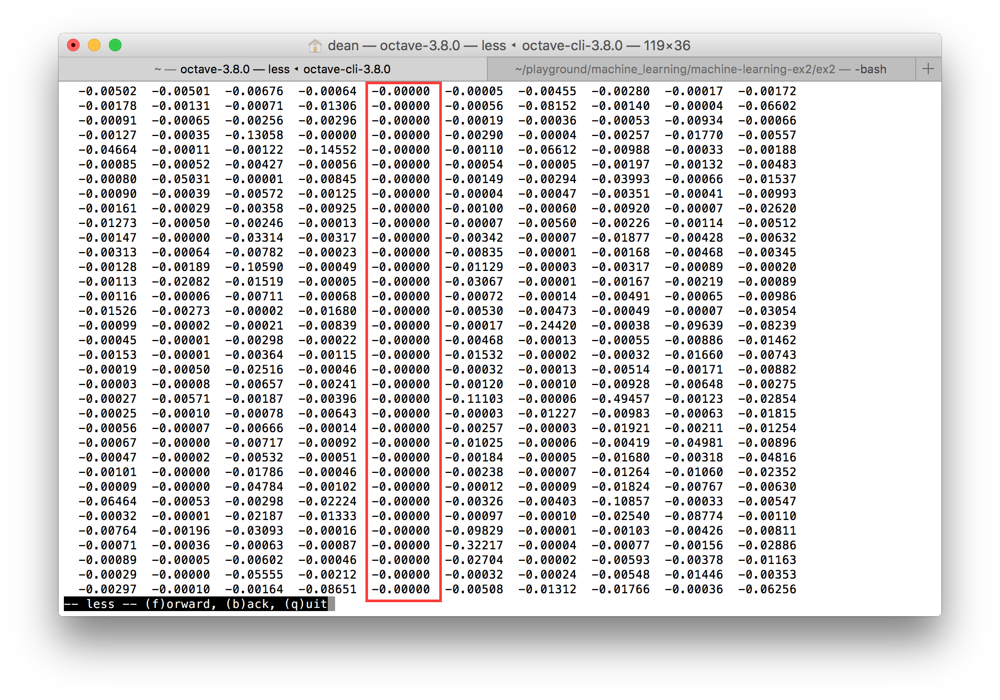

# Neural Networks: Learning

y_matrix is expanding the y output values from a 5000x1 matrix into a 5000x10 matrix of single values.  

J = 1/m * sum(-y' * log(h) - (1-y')*log(1-h)) + lambda/(2*m) * sum( (theta(2:end).^2) );

